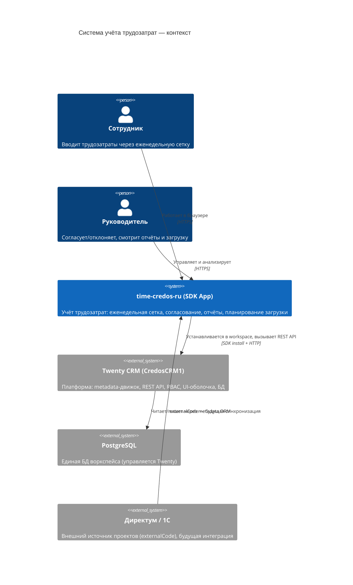
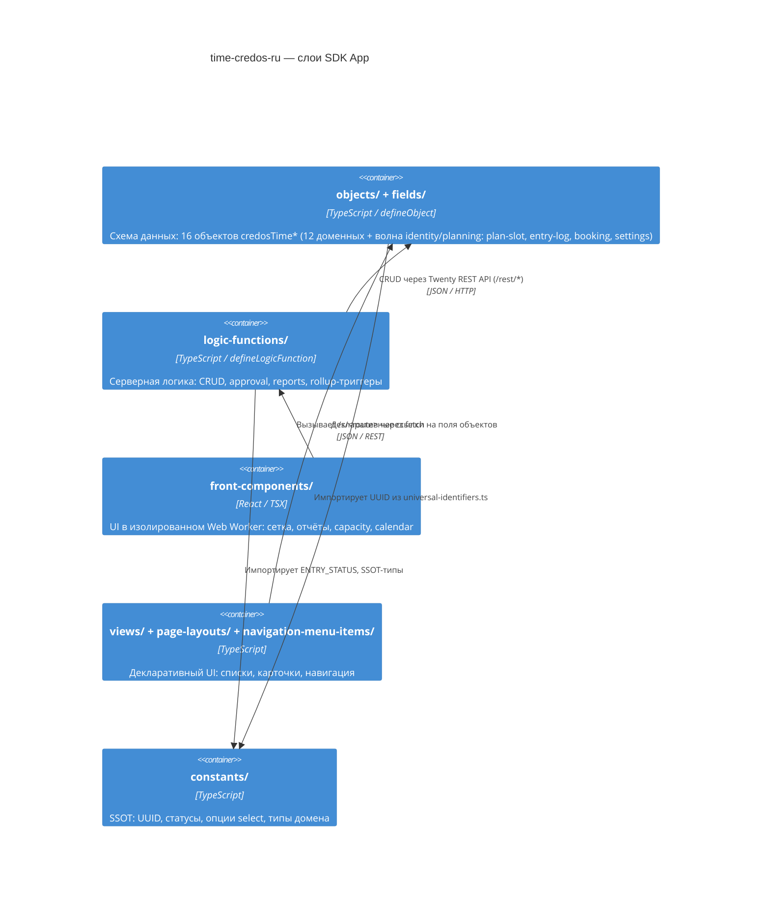

# 01 — Архитектура

## C4 Контекст (уровень системы)



## C4 Контейнеры (внутри SDK App)



---

## Слои системы

| Слой | Директория | Технология | Роль |
|------|------------|-----------|------|
| Схема данных | `objects/`, `fields/` | `defineObject` | Объявляет объекты, поля, связи — SDK создаёт таблицы в PostgreSQL |
| Серверная логика | `logic-functions/` | `defineLogicFunction` | HTTP-роуты `/s/*` и database-event триггеры; имеет доступ к `process.env` и БД через REST |
| Реактивный UI | `front-components/` | React, TSX | Выполняется в Web Worker (песочница): нет `document`, нет прямого доступа к БД |
| Декларативный UI | `views/`, `page-layouts/`, `navigation-menu-items/` | `defineView`, `definePageLayout` | SDK рендерит стандартные списки/карточки по этим декларациям |
| SSOT констант | `constants/` | TypeScript | UUID, статусы, enum-опции, labels; импортируются всеми остальными слоями |

---

## Ключевые ADR

| ADR | Решение | Почему |
|-----|---------|--------|
| ADR-0001 | Платформа — Twenty CRM; данные внутри одной БД | Избегаем отдельного деплоя и интеграционного слоя для внутреннего инструмента |
| ADR-0002 | Time tracking — SDK App, изолированный репо | Изоляция от форка; нет merge-конфликтов с ядром; upgrade-safe |
| ADR-0003 | Catalog — отдельный app; общие мастер-данные (Employee) | Изоляция бизнес-доменов; PII Employee защищается через RBAC |
| ADR-0004 | Префикс `credosTime` для всех объектов | Избегаем коллизий с CRM-объектами в общем workspace |
| ADR-0005 | Prod-топология: Railway + отдельный `TWENTY_APP_ACCESS_TOKEN` | Минимальная поверхность атаки: токен только для этого app |
| ADR-0006 | `credosTimeEmployee` ≠ `WorkspaceMember` | `WorkspaceMember` = аутентификация; `Employee` = HR-профиль (отдел, FTE%) |
| ADR-0007 | Норма рабочих часов — единственный источник: `credosTimeWorkdayCalendar` | Сетка и дашборд показывают одну и ту же норму (устранение расхождения фронт/сервер) |

---

## Зоны разработки Dev1 / Dev2

Правило: **два разработчика не пишут одни и те же файлы одновременно**. Зоны разделены по слоям.

```
apps/time/src/
├── objects/          ← Dev2 (бэкенд)
├── fields/           ← Dev2 (бэкенд)
├── logic-functions/  ← Dev2 (бэкенд)
├── scripts/          ← Dev2 (бэкенд)
├── constants/        ← Shared (согласовать изменения UUID с архитектором)
│
├── front-components/ ← Dev1 (фронт)
├── views/            ← Dev1 (фронт)
├── page-layouts/     ← Dev1 (фронт)
└── navigation-menu-items/ ← Dev1 (фронт)
```

| Зона | Dev | Файлы | Нельзя |
|------|-----|-------|--------|
| Бэкенд | Dev2 | `objects/`, `fields/`, `logic-functions/`, `scripts/` | Трогать `front-components/` без согласования |
| Фронт | Dev1 | `front-components/`, `views/`, `page-layouts/`, `navigation-menu-items/` | Трогать `objects/`, `logic-functions/` без согласования |
| Shared | Оба | `constants/universal-identifiers.ts`, `constants/domain-types.ts` | UUID добавлять только через PR, избегать конфликтов |

> **Note:** `constants/universal-identifiers.ts` — самый критичный shared файл. UUID стабильны между деплоями. Никогда не менять существующие UUID — только добавлять новые.

---

## Зоны безопасности кода (из DEV_STANDARDS.md)

| Зона | Что | Правила |
|------|-----|---------|
| Зелёная | `apps/time/` — весь SDK пакет | Свободно; 99% работы здесь |
| Жёлтая | Правки ядра форка CredosCRM1 | Только при необходимости; маркеры `// CREDOS-BEGIN/END`; запись в `core-changes.md` |
| Красная | `engine/`, `twenty-orm/`, `workspace-schema-builder/`, `auth/` | Никогда не трогать |

---

## Паттерны SDK, которые нужно знать

### Один файл — одна функция (event triggers)

SDK требует ровно одного `defineLogicFunction` на файл для database-event триггеров. Три триггера factHours → три файла:

```
project-fact-rollup-created.logic.ts   (eventName: 'credosTimeEntry.created')
project-fact-rollup-updated.logic.ts   (eventName: 'credosTimeEntry.updated')
project-fact-rollup-deleted.logic.ts   (eventName: 'credosTimeEntry.deleted')
```

### Front-компоненты в песочнице

Front-компоненты выполняются в Web Worker. Нельзя:
- `document.querySelector`, `window.*`, `localStorage`
- Прямые запросы к БД или PostgreSQL

Можно:
- `fetch('/s/<route>')` — вызов logic-function
- `fetch('/rest/*')` — Twenty REST API (с осторожностью, только для чтения)

### UUID из SSOT — всегда

```typescript
// Правильно
import { CREDOS_TIME_ENTRY_OBJECT_UNIVERSAL_IDENTIFIER } from 'src/constants/universal-identifiers';

// Неправильно — inline UUID
universalIdentifier: 'e4d7eda0-9347-4cea-808a-fae0d4912b3c',  // НЕЛЬЗЯ
```

Исключение: поля внутри `defineObject`, объявленные без константы (например, скаляры `code`, `date` — в этом случае UUID вносится в `universal-identifiers.ts` при следующем коммите, если поле понадобится в view).
