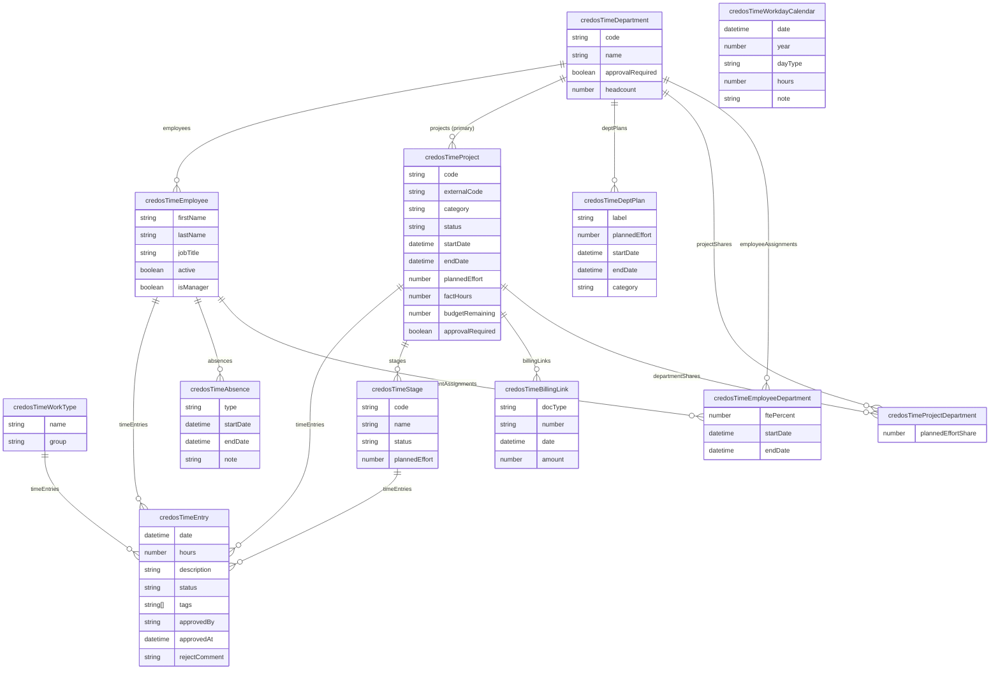

# 02 — Модель данных

## ERD (Entity-Relationship Diagram)



---

## Объекты и поля

### credosTimeEntry — Запись трудозатрат

Атом учёта: одна строка = один день + проект + сотрудник + часы.

| Поле | Тип SDK | Обязательное | Описание |
|------|---------|-------------|----------|
| `date` | `DATE_TIME` | Да | Дата записи (`defaultValue: 'now'`) |
| `hours` | `NUMBER (FLOAT, 2)` | Да | Часы (0.5 / 0.75 / 8.0) |
| `description` | `TEXT` | Нет | Состав работ; используется как `labelIdentifier` карточки |
| `status` | `SELECT` | Да | Статус жизненного цикла; дефолт `DRAFT` |
| `tags` | `MULTI_SELECT` | Нет | Теги (Kimai-паттерн); см. EntryTag ниже |
| `approvedBy` | `TEXT` | Нет | `userWorkspaceId` руководителя; заполняет `/s/approval` |
| `approvedAt` | `DATE_TIME` | Нет | Момент согласования/отклонения |
| `rejectComment` | `TEXT` | Нет | Причина отклонения (видит сотрудник); очищается при re-submit |
| `employee` | `RELATION (MANY_TO_ONE)` | Да | → `credosTimeEmployee` (CASCADE) |
| `project` | `RELATION (MANY_TO_ONE)` | Да | → `credosTimeProject` (CASCADE) |
| `stage` | `RELATION (MANY_TO_ONE)` | Нет | → `credosTimeStage` (SET_NULL) |
| `workType` | `RELATION (MANY_TO_ONE)` | Нет | → `credosTimeWorkType` (SET_NULL) |

**Статусы (SSOT: `src/constants/approval.ts`):**

```
DRAFT → SUBMITTED → APPROVED
                 ↓
              REJECTED → DRAFT (re-submit)
```

| Статус | SDK-значение | Описание |
|--------|-------------|----------|
| Черновик | `DRAFT` | Сотрудник ещё редактирует |
| На согласовании | `SUBMITTED` | Отправлено руководителю |
| Согласовано | `APPROVED` | Зафиксировано; блокировка изменений (CISO-011) |
| Отклонено | `REJECTED` | Возвращено с комментарием |

**Теги EntryTag (MULTI_SELECT, UPPER_SNAKE_CASE):**

| Значение | Ярлык | Цвет |
|----------|-------|------|
| `OVERTIME` | Сверхурочно | red |
| `URGENT` | Срочно | orange |
| `REMOTE` | Удалённо | sky |
| `ON_SITE` | На площадке | turquoise |
| `REWORK` | Доработка | yellow |
| `RESEARCH` | Исследование | purple |

---

### credosTimeProject — Проект

| Поле | Тип SDK | Обязательное | Описание |
|------|---------|-------------|----------|
| `code` | `TEXT` | Да | Внутренний код проекта; `labelIdentifier` карточки |
| `externalCode` | `TEXT` | Нет | Код в Директум/1С для сверки |
| `category` | `SELECT` | Да | Категория работ (Client/Presale/Pilot/Internal/Infrastructure/Training) |
| `status` | `SELECT` | Да | Статус (PLANNED/ACTIVE/ON_HOLD/DONE); дефолт `ACTIVE` |
| `startDate` | `DATE_TIME` | Нет | Дата начала |
| `endDate` | `DATE_TIME` | Нет | Дата окончания |
| `plannedEffort` | `NUMBER (FLOAT, 2)` | Нет | Плановые часы |
| `factHours` | `NUMBER (FLOAT, 2)` | Нет | **Derived-stored**: Σ hours всех записей проекта |
| `budgetRemaining` | `NUMBER (FLOAT, 2)` | Нет | **Derived-stored**: `plannedEffort − factHours` |
| `approvalRequired` | `BOOLEAN` | Нет | `null` = наследует настройку отдела |
| `serviceRef` | `TEXT` | Нет | Задел под каталог услуг (фаза 2) |
| `company` | `RELATION (MANY_TO_ONE)` | Нет | → стандартный `Company` CRM |
| `department` | `RELATION (MANY_TO_ONE)` | Да | → `credosTimeDepartment` (основной отдел) |
| `owner` | `RELATION (MANY_TO_ONE)` | Нет | → стандартный `WorkspaceMember` |
| `manager` | `RELATION (MANY_TO_ONE)` | Нет | → стандартный `WorkspaceMember` |

---

### credosTimeDepartment — Отдел

| Поле | Тип SDK | Обязательное | Описание |
|------|---------|-------------|----------|
| `name` | `TEXT` (auto) | Да | Название отдела |
| `code` | `TEXT` | Нет | Код (OV, OIB, OPIB, TC, OPR) |
| `approvalRequired` | `BOOLEAN` | Нет | Требуется ли согласование трудозатрат |
| `headcount` | `NUMBER` | Нет | Плановая численность (штатное расписание) |

---

### credosTimeEmployee — Сотрудник

> **Note:** `credosTimeEmployee` — HR-профиль (отдел, ставка, признак руководителя). Аутентификация — через стандартный `WorkspaceMember`. Связь: `WorkspaceMember.id` ↔ `employee.workspaceMemberRef` (не объектная — строковый текстовый ID).

| Поле | Тип SDK | Обязательное | Описание |
|------|---------|-------------|----------|
| `firstName` | `TEXT` | Да | Имя |
| `lastName` | `TEXT` | Да | Фамилия |
| `jobTitle` | `TEXT` | Нет | Должность |
| `active` | `BOOLEAN` | Да | Активен ли сотрудник; дефолт `true` |
| `isManager` | `BOOLEAN` | Нет | Признак руководителя: даёт доступ к approve/reject в UI |
| `department` | `RELATION (MANY_TO_ONE)` | Нет | → `credosTimeDepartment` (основной отдел; fallback если нет EmployeeDepartment) |

---

### credosTimeWorkType — Вид работ

| Поле | Тип SDK | Обязательное | Описание |
|------|---------|-------------|----------|
| `name` | `TEXT` | Да | Название вида работ |
| `group` | `SELECT` | Нет | Группа (production / projectManagement / presale / meetings / training / internal) |
| `department` | `RELATION (MANY_TO_ONE)` | Нет | `null` = глобальный вид работ; указан = вид работ отдела |

---

### credosTimeProjectDepartment — Доля отдела в проекте (REQ-0013)

Join-объект: проект × отдел × доля плановых часов.

| Поле | Тип SDK | Обязательное | Описание |
|------|---------|-------------|----------|
| `plannedEffortShare` | `NUMBER (FLOAT, 2)` | Нет | Доля плановых часов отдела в проекте (часы) |
| `project` | `RELATION (MANY_TO_ONE)` | Да | → `credosTimeProject` |
| `department` | `RELATION (MANY_TO_ONE)` | Да | → `credosTimeDepartment` |

---

### credosTimeEmployeeDepartment — FTE-назначение (REQ-0011)

Join-объект: сотрудник × отдел × доля ставки × период.

| Поле | Тип SDK | Обязательное | Описание |
|------|---------|-------------|----------|
| `ftePercent` | `NUMBER (FLOAT, 2)` | Да | Доля ставки в отделе (0..100) |
| `startDate` | `DATE_TIME` | Нет | Начало назначения |
| `endDate` | `DATE_TIME` | Нет | Окончание назначения (`null` = бессрочно) |
| `employee` | `RELATION (MANY_TO_ONE)` | Да | → `credosTimeEmployee` |
| `department` | `RELATION (MANY_TO_ONE)` | Да | → `credosTimeDepartment` |

---

### credosTimeAbsence — Отсутствие

| Поле | Тип SDK | Обязательное | Описание |
|------|---------|-------------|----------|
| `type` | `SELECT` | Да | VACATION / SICK / UNPAID / OTHER |
| `startDate` | `DATE_TIME` | Да | Начало отсутствия |
| `endDate` | `DATE_TIME` | Да | Конец отсутствия |
| `note` | `TEXT` | Нет | Примечание (не для медицинских данных — CISO-008) |
| `employee` | `RELATION (MANY_TO_ONE)` | Да | → `credosTimeEmployee` |

---

### credosTimeDeptPlan — Плановая загрузка отдела (REQ-0012)

Резерв / пресейл-бронь отдела без привязки к проекту.

| Поле | Тип SDK | Обязательное | Описание |
|------|---------|-------------|----------|
| `label` | `TEXT` | Да | Название брони |
| `plannedEffort` | `NUMBER (FLOAT, 2)` | Нет | Плановые часы брони |
| `startDate` | `DATE_TIME` | Нет | Период начала |
| `endDate` | `DATE_TIME` | Нет | Период окончания |
| `category` | `SELECT` | Нет | Категория (как у проекта) |
| `department` | `RELATION (MANY_TO_ONE)` | Да | → `credosTimeDepartment` |

---

### credosTimeWorkdayCalendar — Производственный календарь РФ

| Поле | Тип SDK | Обязательное | Описание |
|------|---------|-------------|----------|
| `date` | `DATE_TIME` | Да | Конкретный день |
| `year` | `NUMBER` | Да | Год (для фильтрации) |
| `dayType` | `SELECT` | Да | WORKDAY / WEEKEND / HOLIDAY / SHORT |
| `hours` | `NUMBER (FLOAT, 2)` | Да | Норма часов дня (8.0 / 7.0 короткий / 0 праздник) |
| `note` | `TEXT` | Нет | Название праздника |

---

## Derived-stored поля: правило A∧B∧C

`factHours` и `budgetRemaining` на `credosTimeProject` — хранимые вычисляемые поля.
Они необходимы для native index-view «Все проекты» (SDK не поддерживает вычисляемые поля в списках).

**Три пути мутации — все три должны обновлять поля (правило A∧B∧C):**

```
A. database-event триггеры (любая мутация записи, включая CSV-импорт и прямой REST)
   ├── project-fact-rollup-created.logic.ts  (credosTimeEntry.created)
   ├── project-fact-rollup-updated.logic.ts  (credosTimeEntry.updated)
   └── project-fact-rollup-deleted.logic.ts  (credosTimeEntry.deleted)

B. /s/time-entry logic function (UPSERT/DELETE из front-компонента)
   └── recalcProjectFactHours() после каждой мутации

C. backfill (post-install и при добавлении новых записей в обход системы)
   └── backfill-project-departments.post-install.ts → recalcAll()
```

**Формулы:**
```
factHours        = Σ(credosTimeEntry.hours WHERE projectId = project.id)
budgetRemaining  = project.plannedEffort − project.factHours
                   (null если plannedEffort не задан)
```

> **Note:** `recalcProjectFactHours` — SSOT функция (shared между триггерами и `/s/time-entry`). Формула в одном месте: `src/logic-functions/project-fact-rollup.ts`.

---

## Связи между объектами (краткая таблица)

| Источник | Поле | Тип | Цель | onDelete |
|----------|------|-----|------|---------|
| `Entry.employee` | `employee` | MANY_TO_ONE | `Employee` | CASCADE |
| `Entry.project` | `project` | MANY_TO_ONE | `Project` | CASCADE |
| `Entry.stage` | `stage` | MANY_TO_ONE | `Stage` | SET_NULL |
| `Entry.workType` | `workType` | MANY_TO_ONE | `WorkType` | SET_NULL |
| `Project.department` | `department` | MANY_TO_ONE | `Department` | SET_NULL |
| `Project.company` | `company` | MANY_TO_ONE | стандартный `Company` | SET_NULL |
| `Project.owner` | `owner` | MANY_TO_ONE | `WorkspaceMember` | SET_NULL |
| `Project.manager` | `manager` | MANY_TO_ONE | `WorkspaceMember` | SET_NULL |
| `ProjectDepartment.project` | `project` | MANY_TO_ONE | `Project` | CASCADE |
| `ProjectDepartment.department` | `department` | MANY_TO_ONE | `Department` | CASCADE |
| `EmployeeDepartment.employee` | `employee` | MANY_TO_ONE | `Employee` | CASCADE |
| `EmployeeDepartment.department` | `department` | MANY_TO_ONE | `Department` | CASCADE |
| `Absence.employee` | `employee` | MANY_TO_ONE | `Employee` | CASCADE |
| `DeptPlan.department` | `department` | MANY_TO_ONE | `Department` | CASCADE |
| `Stage.project` | `project` | MANY_TO_ONE | `Project` | CASCADE |
| `BillingLink.project` | `project` | MANY_TO_ONE | `Project` | CASCADE |
| `WorkType.department` | `department` | MANY_TO_ONE | `Department` | SET_NULL |

> **Note:** Обратные стороны (ONE_TO_MANY) вынесены в `src/fields/` отдельными файлами для соблюдения лимита размера объектов.
