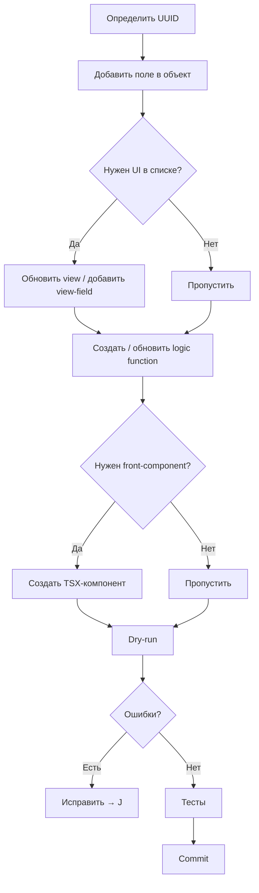

# 03 — Как добавить фичу (пошаговый tutorial)

Пример: добавляем поле `estimatedHours` (оценка часов на запись трудозатрат) и API-роут `/s/entry-estimate`, который принимает `entryId` и возвращает отклонение от оценки.

---

## Flowchart процесса



---

## Шаг 1. Добавить UUID в `universal-identifiers.ts`

Каждая новая сущность (поле, объект, view, logic function) требует UUID. UUID генерируется один раз и никогда не меняется.

```bash
# Сгенерировать UUID v4
node -e "const {randomUUID} = require('crypto'); console.log(randomUUID())"
```

Добавить в `src/constants/universal-identifiers.ts`:

```typescript
// --- estimatedHours (поле оценки на credosTimeEntry) ---
// REQ-XXXX: оценка плановых часов для записи трудозатрат.
export const CREDOS_TIME_ENTRY_ESTIMATED_HOURS_FIELD_ID =
  '<сгенерированный UUID>';

// Logic-функция /s/entry-estimate
export const ENTRY_ESTIMATE_LOGIC_FUNCTION_UNIVERSAL_IDENTIFIER =
  '<сгенерированный UUID>';
```

> **Note:** Константа называется по паттерну: `CREDOS_TIME_<ОБЪЕКТ>_<ПОЛЕ>_FIELD_ID` для полей, `<FEATURE>_LOGIC_FUNCTION_UNIVERSAL_IDENTIFIER` для logic functions. Всегда добавляй комментарий — откуда пришло требование.

---

## Шаг 2. Добавить поле в объект (`objects/`)

Открыть `src/objects/credos-time-entry.object.ts`. В массив `fields` добавить:

```typescript
import {
  CREDOS_TIME_ENTRY_ESTIMATED_HOURS_FIELD_ID,
} from 'src/constants/universal-identifiers';

// В массиве fields объекта:
{
  universalIdentifier: CREDOS_TIME_ENTRY_ESTIMATED_HOURS_FIELD_ID,
  name: 'estimatedHours',
  type: FieldType.NUMBER,
  label: 'Оценка (часы)',
  icon: 'IconClockQuestion',
  isNullable: true,
  defaultValue: null,
  universalSettings: { dataType: NumberDataType.FLOAT, decimals: 2 },
},
```

> **Note:** Не забудь импорт константы. Тип — из `twenty-sdk/define` (FieldType.NUMBER, FieldType.TEXT и т.д.). Новые nullable-поля не нарушают существующие записи.

Проверить лимит размера файла:

```bash
wc -l apps/time/src/objects/credos-time-entry.object.ts
# Должно быть < 200 строк
```

Если файл приближается к 200 строкам — вынести обратные поля (ONE_TO_MANY) в `src/fields/`.

---

## Шаг 3. Обновить view (если поле нужно в списке)

Если новое поле должно отображаться в index-view «Записи трудозатрат», открыть `src/views/credos-time-entry.view.ts` и добавить view-field:

```typescript
import { CREDOS_TIME_ENTRY_ESTIMATED_HOURS_FIELD_ID } from 'src/constants/universal-identifiers';

// В массиве viewFields:
{
  universalIdentifier: '<новый UUID для viewField из universal-identifiers.ts>',
  fieldMetadataUniversalIdentifier: CREDOS_TIME_ENTRY_ESTIMATED_HOURS_FIELD_ID,
  position: 6,  // следующая позиция
  isVisible: true,
},
```

> **Note:** UUID viewField — отдельный UUID, не тот же что у поля. Добавить в `universal-identifiers.ts` как `CREDOS_TIME_ENTRY_VF_ESTIMATED_HOURS = '<uuid>'`.

Если поле нужно только в карточке записи (RECORD_PAGE), то view не трогать — карточка подтягивает все поля объекта автоматически через FIELDS-виджет.

---

## Шаг 4. Создать logic function

Использовать scaffolding SDK или создать файл вручную.

### Вариант A — scaffolding (рекомендуется)

```bash
cd apps/time
yarn twenty dev:add logicFunction
# SDK запросит имя и сгенерирует src/logic-functions/<name>.logic.ts с шаблоном
```

### Вариант B — вручную

Создать `src/logic-functions/entry-estimate.logic.ts`:

```typescript
import { defineLogicFunction } from 'twenty-sdk/define';
import type { RoutePayload } from 'twenty-sdk/logic-function';

import { ENTRY_ESTIMATE_LOGIC_FUNCTION_UNIVERSAL_IDENTIFIER } from 'src/constants/universal-identifiers';
import { isUuid } from './params-validate';

// Константы для REST-клиента
const apiBase = () => (process.env.TWENTY_API_URL ?? '').replace(/\/$/, '');
const authHeaders = () => ({
  Authorization: `Bearer ${process.env.TWENTY_APP_ACCESS_TOKEN ?? ''}`,
  'Content-Type': 'application/json',
});

export default defineLogicFunction({
  universalIdentifier: ENTRY_ESTIMATE_LOGIC_FUNCTION_UNIVERSAL_IDENTIFIER,
  name: 'entry-estimate',
  handler: async (event: RoutePayload) => {
    const params = (event.queryStringParameters ?? {}) as Record<string, string>;

    // CISO-006: валидация params ПЕРЕД интерполяцией в filter-строки
    const entryId = isUuid(params.entryId)
      ? params.entryId
      : (() => { throw new Error('invalid entryId'); })();

    // Получить запись
    const res = await fetch(
      `${apiBase()}/rest/credosTimeEntries/${entryId}?fields=hours,estimatedHours`,
      { headers: authHeaders() }
    );
    if (!res.ok) {
      return { statusCode: res.status, body: JSON.stringify({ error: 'not_found' }) };
    }

    const entry = (await res.json()) as { hours: number; estimatedHours: number | null };

    const deviation = entry.estimatedHours !== null
      ? entry.hours - entry.estimatedHours
      : null;

    return {
      statusCode: 200,
      body: JSON.stringify({
        entryId,
        hours: entry.hours,
        estimatedHours: entry.estimatedHours,
        deviation,
      }),
    };
  },
  timeoutSeconds: 10,
});
```

**Правила logic function:**

- Один `defineLogicFunction` на файл (особенно важно для database-event триггеров)
- Всегда валидировать UUID и даты из `params` перед использованием (CISO-006)
- Возвращать `{ statusCode, body }` где `body` — JSON-строка
- `TWENTY_API_URL` и `TWENTY_APP_ACCESS_TOKEN` инжектируются платформой; не хардкодить
- Тип `timeoutSeconds` — разумный дефолт 10; для heavy-операций до 60

### Database-event триггер (пример)

```typescript
import { defineLogicFunction } from 'twenty-sdk/define';
import type { DatabaseEventPayload } from 'twenty-sdk/logic-function';

export default defineLogicFunction({
  universalIdentifier: '<UUID>',
  name: 'my-trigger-on-created',
  databaseEventTriggerSettings: {
    eventName: 'credosTimeEntry.created',   // единственное событие на файл
  },
  handler: async (event: DatabaseEventPayload) => {
    const { after } = event;   // новая запись после создания
    // after.projectId, after.hours и т.д.
    console.log('entry created:', after.id);
  },
});
```

---

## Шаг 5. Создать front-component (если нужен UI)

Scaffolding:

```bash
yarn twenty dev:add frontComponent
# → src/front-components/<name>.front-component.tsx (точка входа)
# → src/front-components/<feature>/<name>.tsx (реальный компонент)
```

Точка входа (`*.front-component.tsx`) подключает UUID виджета:

```typescript
import { defineFrontComponent } from 'twenty-sdk/define';
import { ENTRY_ESTIMATE_FRONT_COMPONENT_UNIVERSAL_IDENTIFIER } from 'src/constants/universal-identifiers';
import { EntryEstimateWidget } from './entry-estimate/entry-estimate-widget';

export default defineFrontComponent({
  universalIdentifier: ENTRY_ESTIMATE_FRONT_COMPONENT_UNIVERSAL_IDENTIFIER,
  component: EntryEstimateWidget,
});
```

Реальный компонент (`src/front-components/entry-estimate/entry-estimate-widget.tsx`):

```typescript
import { useState, useEffect } from 'react';

// Front-компонент выполняется в Web Worker (песочница).
// Нельзя: document.*, window.*, localStorage.
// Можно: fetch('/s/entry-estimate?entryId=...'), useState, useEffect.

type Props = { entryId: string };

export const EntryEstimateWidget = ({ entryId }: Props) => {
  const [data, setData] = useState<{ deviation: number | null } | null>(null);

  useEffect(() => {
    fetch(`/s/entry-estimate?entryId=${encodeURIComponent(entryId)}`)
      .then((r) => r.json())
      .then(setData)
      .catch(console.error);
  }, [entryId]);

  if (!data) return <div>Загрузка...</div>;
  if (data.deviation === null) return <div>Оценка не задана</div>;

  return (
    <div>
      Отклонение от оценки: <strong>{data.deviation}ч</strong>
    </div>
  );
};
```

**Правила front-components:**

- Компонент < 150 строк; хук < 100 строк
- Нет обращений к DOM (`document.querySelector` и т.п.)
- Все мутации — только через `/s/<route>` (logic function), не прямой REST
- Нет `any` в типах

---

## Шаг 6. Dry-run

```bash
cd apps/time
yarn twenty dev --once --dry-run
```

Что проверяет dry-run:
- Все `universalIdentifier` уникальны и валидный UUID v4
- Каждый `defineView` ссылается на существующий объект
- Каждый `defineNavigationMenuItem` ссылается на существующий view
- Нет дублирующихся имён объектов/полей
- Схема поля совместима с типом (например, `MULTI_SELECT` требует `options`)

Если видишь ошибки типа `"universalIdentifier already exists"` — проверь `universal-identifiers.ts` на дубликаты.

---

## Шаг 7. Тесты

Тест-файлы располагаются рядом с модулем:

```
src/logic-functions/entry-estimate.logic.ts
src/logic-functions/entry-estimate.test.ts    ← тесты
```

Минимальный тест для новой logic function:

```typescript
// src/logic-functions/entry-estimate.test.ts
import { describe, it, expect, vi } from 'vitest';

// Мокаем fetch и process.env
vi.stubGlobal('fetch', vi.fn());
process.env.TWENTY_API_URL = 'http://localhost';
process.env.TWENTY_APP_ACCESS_TOKEN = 'test-token';

describe('entry-estimate', () => {
  it('возвращает отклонение если оценка задана', async () => {
    (fetch as ReturnType<typeof vi.fn>).mockResolvedValueOnce({
      ok: true,
      json: async () => ({ hours: 8, estimatedHours: 6 }),
    });

    const handler = (await import('./entry-estimate.logic')).default.handler;
    const result = await handler({
      queryStringParameters: { entryId: 'e4d7eda0-9347-4cea-808a-fae0d4912b3c' },
    } as any);

    const body = JSON.parse(result.body as string);
    expect(body.deviation).toBe(2);
  });

  it('отклоняет невалидный entryId (CISO-006)', async () => {
    const handler = (await import('./entry-estimate.logic')).default.handler;
    await expect(
      handler({ queryStringParameters: { entryId: 'not-a-uuid' } } as any)
    ).rejects.toThrow('invalid entryId');
  });
});
```

Запуск тестов:

```bash
cd apps/time
yarn test                    # все тесты
yarn test entry-estimate     # только этот модуль
yarn test --coverage         # с покрытием
```

---

## Шаг 8. Commit

### Pre-commit чеклист

```
[ ] yarn twenty dev --once --dry-run  →  0 ошибок
[ ] yarn test                          →  все зелёные
[ ] wc -l <файл>                       →  < 200 строк на файл
[ ] Нейминг: credosTime* (объекты), camelCase (поля), kebab-case (файлы)
[ ] Labels/ярлыки русские
[ ] UUID только через universal-identifiers.ts
[ ] Валидация params ПЕРЕД filter-строками (CISO-006)
[ ] Без реальных данных в коде (CISO-009)
```

### Формат коммита

```bash
git add apps/time/src/logic-functions/entry-estimate.logic.ts \
        apps/time/src/logic-functions/entry-estimate.test.ts \
        apps/time/src/objects/credos-time-entry.object.ts \
        apps/time/src/constants/universal-identifiers.ts

git commit -m "feat(time): поле estimatedHours + /s/entry-estimate для расчёта отклонения"
```

Conventional commits: `feat(time):`, `fix(time):`, `chore:`, `docs:`.
Описания — по-русски (per CLAUDE.md).

---

## Частые ошибки

| Ошибка | Причина | Решение |
|--------|---------|---------|
| `universalIdentifier already exists` | UUID совпадает с другой сущностью | Сгенерировать новый UUID |
| `Object not found` в view | View ссылается на несуществующий объект | Проверить `nameSingular` в `defineView` |
| `Front-component has scroll` | Компонент не адаптирован под fixed-высоту виджета | Использовать CSS с `height: 100%`, не `overflow: auto` на корне |
| `Cannot read properties of undefined` в Web Worker | Обращение к `document.*` или `window.*` | Убрать host-DOM зависимости, использовать только API fetch |
| `invalid entryId` в тесте | Тест передаёт невалидный UUID | Использовать настоящий UUID v4 в тестах |
| Файл > 200 строк | Объект с множеством обратных полей | Вынести ONE_TO_MANY-поля в `src/fields/<name>.field.ts` |
