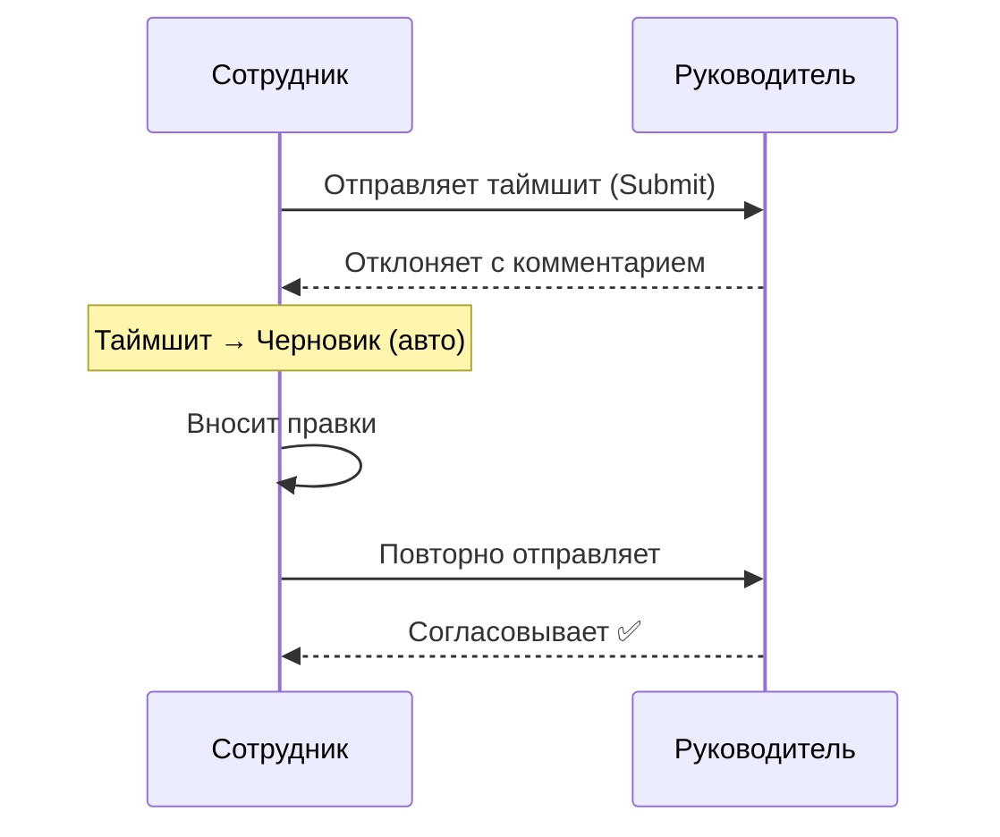
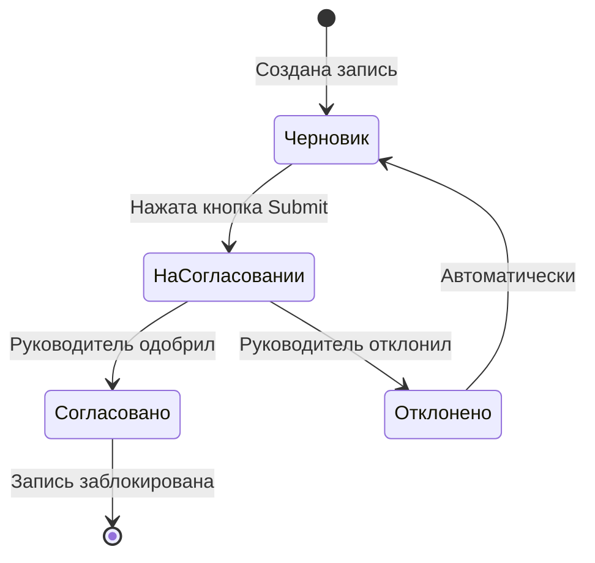

# 02. Заполнение таймшита

В этом разделе подробно описано всё, что можно делать в еженедельной сетке трудозатрат: от навигации до тегов и отправки на согласование.

---

## Как открыть таймшит

1. В левом меню платформы выберите **«Мои часы»**.
2. Откроется дашборд с двумя панелями:
   - **Верхняя** — сводка ваших часов за текущий период (статусы, итоги).
   - **Нижняя** — сетка ввода часов за текущую неделю.
3. Если вы хотите сразу перейти к сетке конкретной недели — воспользуйтесь навигацией (см. ниже).

> 📸 [Скриншот: дашборд «Мои часы» — сводные карточки сверху, сетка снизу]

---

## Навигация по неделям

Сетка показывает одну неделю (Пн–Вс). Для смены недели:

- Кнопка **‹** — перейти к предыдущей неделе.
- Кнопка **›** — перейти к следующей неделе.
- Кнопка **«Сегодня»** — вернуться к текущей неделе.
- В заголовке отображается диапазон дат: **«Пн 16 — Вс 22 июн 2025»**.

> 📸 [Скриншот: шапка сетки — стрелки навигации, заголовок недели, кнопка «Сегодня»]

### Нормы часов в шапке

Под каждой датой в шапке сетки указана **норма рабочего дня** из производственного календаря:

| Отображение | Что означает |
|-------------|--------------|
| `8 ч` | Стандартный рабочий день |
| `7 ч` | Предпраздничный сокращённый день |
| `—` | Выходной или праздник |

> **Заметка:** Нормы берутся из производственного календаря РФ, настроенного администратором. Они носят справочный характер — вы можете вводить любое количество часов.

---

## Структура сетки

```
┌─────────────────────────────────┬──────┬──────┬──────┬──────┬──────┬──────┬──────┬──────────┐
│ Проект / Вид работ              │  Пн  │  Вт  │  Ср  │  Чт  │  Пт  │  Сб  │  Вс  │  Итого   │
│                                 │  8ч  │  8ч  │  8ч  │  7ч  │  8ч  │  —   │  —   │          │
├─────────────────────────────────┼──────┼──────┼──────┼──────┼──────┼──────┼──────┼──────────┤
│ Проект А / Производственная     │  6   │  8   │  7   │  7   │  5   │      │      │   33     │
│ Проект Б / Совещания            │  2   │      │  1   │      │  3   │      │      │    6     │
├─────────────────────────────────┼──────┼──────┼──────┼──────┼──────┼──────┼──────┼──────────┤
│ ИТОГО                           │  8   │  8   │  8   │  7   │  8   │      │      │   39     │
└─────────────────────────────────┴──────┴──────┴──────┴──────┴──────┴──────┴──────┴──────────┘
```

- **Строка** = один проект + один вид работ.
- **Ячейка** = часы за конкретный день.
- **Строка «ИТОГО»** — сумма по всем строкам за каждый день и за неделю.

---

## Добавление строки (проект + вид работы)

Каждый вид деятельности добавляется отдельной строкой.

1. Нажмите **«+ Добавить строку»** под таблицей.
2. В форме выберите **Проект** из выпадающего списка.
   - Список отсортирован: сначала идут проекты, которые вы использовали недавно.
   - Начните вводить название — список отфильтруется.
3. Выберите **Вид работ** (появится после выбора проекта).
4. Нажмите **«Добавить»** — строка появится в сетке.

> 📸 [Скриншот: форма «+ Добавить строку» с выбранным проектом и видом работ]

### Меню строки (⋯)

Слева у каждой строки — кнопка **⋯** (всегда видима). В меню:
- **Заполнить будни нормой** — норма дня в пустые рабочие дни строки;
- **Комментарий к записи…** — заметка к дню;
- **Дублировать строку** — тот же проект, останется выбрать другой вид работ;
- **Обнулить часы** — очистить часы строки (обратимо, тост «Отменить»);
- **Убрать строку** — удалить строку (с подтверждением и счётчиком записей).

У согласованной/закрытой строки меню ограничено (только просмотр/дублирование).

> **Заметка:** Одинаковую комбинацию «проект + вид работ» добавить дважды нельзя — система не допустит дубликатов в рамках одной недели.

---

## Ввод часов

### Базовый ввод

1. Кликните на ячейку нужного дня — откроется ввод (первый клик сразу редактирует).
2. Введите часы. Принимаются разные форматы: `8` · `7.5` или `7,5` (точка и запятая) · `8:30` · `1ч30м` · `90м`.
3. Нажмите **Enter/Tab** или кликните на другую ячейку — часы сохранятся автоматически.

> **Форматы:** дробные часы можно через точку ИЛИ запятую (`1.5` = `1,5` = «1 час 30 минут»). Также понимаются `1:30` и `1ч30м`. При нераспознанном вводе ячейка подсветится красным с подсказкой формата.

### Быстрое заполнение всех будней строки

Если весь день вы работали над одним проектом:

1. Кликните на нужную ячейку, введите число.
2. Нажмите **Alt+→** — значение применится ко всем рабочим дням строки (по производственному календарю), не затрагивая выходные/праздники.

> **Заметка:** заполняются именно рабочие дни. То же действие доступно из меню строки **⋯ → «Заполнить будни нормой»**. (Клавиша **Shift+Enter** в сетке = «подтвердить и вверх», НЕ заполнение.)

### Клавиатурная навигация

Полный список — по клавише **?** в тулбаре (cheatsheet). Актуальные сочетания:

| Действие | Клавиша |
|----------|---------|
| Перемещение по ячейкам | ↑ ↓ ← → |
| К первой / последней ячейке строки | Home / End |
| К началу / концу сетки | Ctrl+Home / Ctrl+End |
| Начать ввод (цифра заменяет значение) | 0–9 |
| Подтвердить и вниз | Enter |
| Подтвердить и вверх | Shift+Enter |
| Подтвердить и вправо / влево | Tab / Shift+Tab |
| Отмена ввода | Esc |
| Удалить запись | 0 / Del |
| Часы ячейки → на все будни строки | Alt+→ |
| Заполнить вниз по столбцу | Ctrl+D |
| Скопировать / вставить значение ячейки | Ctrl+C / Ctrl+V |
| Подсказка по клавишам | ? |

> Удаление обратимо: после очистки появляется тост **«Отменить»** (5 с).

---

## Чей это таймшит

В шапке сетки всегда показано **«Таймшит: ФИО · Отдел»** — даже для собственного, чтобы не перепутать. При скрытых ФИО (настройка ПДн) — код сотрудника.

Руководитель видит селектор **«Таймшит сотрудника»** и может открыть/заполнить таймшит подчинённого — см. [Согласование → Ввод за сотрудника](03-approval.md). Записи руководителя помечаются чипом **«🧑 рук.»**.

---

## Заблокированные ячейки (🔒)

Ячейка бывает **read-only** (🔒) по двум причинам:
1. **Согласовано** — запись прошла согласование (изменить — только через отзыв, см. [Согласование](03-approval.md)).
2. **Период закрыт** — администратор закрыл прошлый период (lockdown): записи с датой ≤ границы заблокированы независимо от статуса.

Клик по 🔒 предлагает отзыв (если есть права) либо сообщение «Период закрыт, обратитесь к администратору».

---

---

## Автосохранение

Система сохраняет данные **автоматически при потере фокуса** (on blur) — то есть как только вы уходите из ячейки. Отдельной кнопки «Сохранить» нет.

В правом верхнем углу сетки отображается индикатор статуса:

| Индикатор | Состояние |
|-----------|-----------|
| 💾 *Сохранение...* | Данные отправляются на сервер |
| ✅ *Сохранено* | Все изменения зафиксированы |
| ⚠️ *Ошибка сохранения* | Проблема с сетью или сервером |

> ⚠️ **Важно:** Если индикатор показывает «Ошибка сохранения» — не закрывайте вкладку. Восстановите соединение (проверьте интернет) и попробуйте снова кликнуть в ячейку.

---

## Теги записи

К каждой строке можно добавить одну или несколько меток (тегов). Теги помогают детальнее классифицировать работу для анализа в отчётах.

### Как добавить тег

1. Кликните на иконку тега (🏷) в левой части нужной строки.
2. В выпадающем меню отметьте нужные метки.
3. Теги сохраняются автоматически.

> 📸 [Скриншот: строка с открытым меню тегов, отмечены OVERTIME и REMOTE]

### Справочник тегов

| Тег | Русское название | Когда использовать |
|-----|------------------|--------------------|
| `OVERTIME` | Переработка | Работа сверх нормы рабочего дня или в выходные |
| `URGENT` | Срочно | Авральная задача с повышенным приоритетом |
| `REMOTE` | Удалённо | Работа из дома или удалённого места |
| `ON_SITE` | На площадке | Работа непосредственно у клиента |
| `REWORK` | Доработка | Повторная работа по уже выполненной задаче |
| `RESEARCH` | Исследование | Изучение технологии, прототипирование, R&D |

> **Заметка:** На одну строку можно поставить несколько тегов одновременно. Например, `OVERTIME` + `ON_SITE` — переработка на площадке клиента.

---

## Отправка на согласование

Когда вы заполнили все часы за неделю и готовы передать их на проверку руководителю:

1. Убедитесь, что все нужные строки заполнены и индикатор показывает **«Сохранено»**.
2. Нажмите кнопку **«Отправить на согласование»** (Submit) в нижней части или в тулбаре сетки.
3. Подтвердите действие в диалоге (если он появится).
4. Статус таймшита изменится: **Черновик → На согласовании**.

> 📸 [Скриншот: кнопка «Отправить на согласование», статус-бар «На согласовании» оранжевого цвета]

### Что происходит после отправки

- Все ячейки переходят в **режим только для чтения** (заблокированы).
- Кнопка «Отправить» исчезает.
- Руководитель видит ваш таймшит в очереди на согласование.
- Вы можете наблюдать за статусом на дашборде «Мои часы».

---

## Что нельзя делать после отправки

После нажатия кнопки «Отправить»:

| Действие | Возможно? |
|----------|-----------|
| Редактировать часы | ❌ Нет — заблокировано |
| Добавить новую строку | ❌ Нет — заблокировано |
| Изменить теги | ❌ Нет — заблокировано |
| Отозвать отправку самостоятельно | ❌ Нет — только руководитель может отклонить |
| Просматривать данные | ✅ Да |

> ⚠️ **Важно:** Если вы ошиблись после отправки, обратитесь к руководителю с просьбой **отклонить** таймшит. После отклонения он вернётся в статус Черновик и снова станет редактируемым.

---

## Редактирование после отклонения

Если руководитель отклонил ваш таймшит:

1. Вы получите уведомление (письмо / уведомление в системе).
2. Таймшит автоматически вернётся в статус **Черновик**.
3. Откройте таймшит — сетка снова станет редактируемой.
4. Прочитайте **комментарий руководителя** — он отображается в статус-баре под сеткой.
5. Внесите исправления.
6. Повторно нажмите **«Отправить на согласование»**.



---

## Статусы таймшита



| Статус | Цвет | Кто может редактировать |
|--------|------|------------------------|
| Черновик | ⬜ Серый | Сотрудник |
| На согласовании | 🟠 Оранжевый | Никто (заблокировано) |
| Согласовано | 🟢 Зелёный | Никто (заблокировано) |
| Отклонено | 🔴 Красный → автоматически Черновик | Сотрудник |

---

## Часто задаваемые вопросы

### ❓ «Нет нужного проекта в списке»

Список проектов ограничен теми, к которым вас добавил администратор или руководитель проекта. Варианты решения:
- Попросите руководителя добавить вас в команду проекта.
- Уточните у администратора, активен ли проект (статус «В работе»).
- Проверьте правописание — начните вводить 3–4 буквы из названия проекта.

### ❓ «Ввёл больше 8 часов в день — это допустимо?»

Да. Система не ограничивает ввод часов сверх нормы. Норма в шапке сетки (`8 ч` / `7 ч`) носит **справочный** характер. Если вы работали 10 часов — введите 10. Для обозначения переработки добавьте тег `OVERTIME`.

### ❓ «Забыл заполнить прошлую неделю»

1. Нажмите стрелку **‹** для перехода к нужной неделе.
2. Заполните часы — прошлые периоды редактируются, пока они в статусе **Черновик**.
3. Отправьте на согласование.

> ⚠️ **Важно:** Если руководитель уже закрыл период — обратитесь к нему или администратору для разблокировки.

### ❓ «Мне нужно занести часы за выходной»

Выходные дни (столбцы с «—» в шапке) доступны для ввода — просто кликните на ячейку. Добавьте тег `OVERTIME`, чтобы отметить это в отчётах.

### ❓ «Сколько строк можно добавить?»

Технического ограничения нет. Добавляйте столько строк, сколько нужно. Для удобства рекомендуется группировать работу по видам деятельности, а не разбивать каждую задачу на отдельную строку.

### ❓ «Как скопировать прошлую неделю?»

В тулбаре есть кнопка **«Скопировать неделю»** — она переносит структуру строк (проекты + виды работ) без часов. Либо кнопка **«Скопировать часы»** — переносит и структуру, и значения часов целиком.

### ❓ «Как заполнить стандартную неделю (8 часов по будням)?»

Используйте кнопку **«Заполнить стандартно»** в тулбаре — она автоматически расставит нормы рабочих часов по производственному календарю во все существующие строки.
