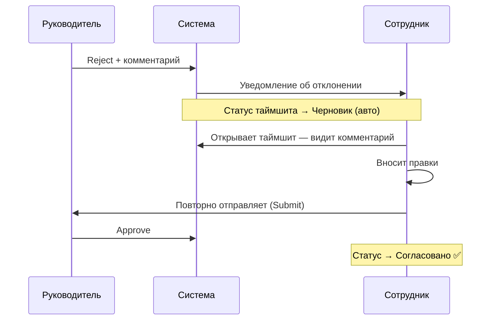
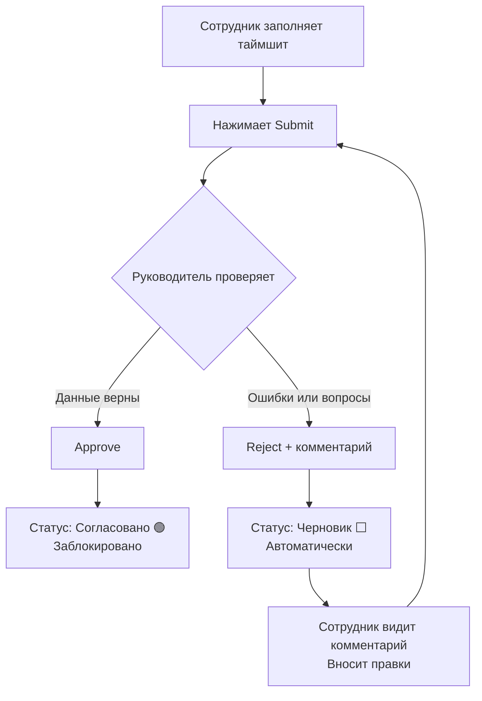

# 03. Согласование таймшитов (для руководителей)

Этот раздел предназначен для руководителей и старших сотрудников, которые согласовывают таймшиты своих подчинённых.

---

## Кто может согласовывать

Право на согласование определяется ролью и привязкой к отделу:

| Роль | Что может делать |
|------|-----------------|
| **Руководитель** | Согласовывать и отклонять таймшиты сотрудников своего отдела |
| **Администратор** | Согласовывать таймшиты любого отдела |
| **Сотрудник** | Только просматривать статус своих таймшитов |

> ⚠️ **Важно:** Руководитель **не может согласовать свой собственный таймшит**. Это принципиальное ограничение системы — собственный таймшит должен согласовать вышестоящий руководитель или администратор.

---

## Где видеть таймшиты подчинённых

### Через дашборд «Мои часы» → вкладка «Команда»

1. Откройте **«Мои часы»** в левом меню.
2. Переключитесь на вкладку **«Команда»** (рядом с «Мои записи»).
3. Вы увидите список сотрудников вашего отдела и статус их таймшита за выбранную неделю.
4. Цветовая индикация статусов:
   - 🟠 **На согласовании** — требует вашего действия
   - 🟢 **Согласовано** — уже обработано
   - ⬜ **Черновик** — сотрудник ещё не отправил
   - 🔴 **Отклонено** — ожидает исправлений сотрудника

> 📸 [Скриншот: вкладка «Команда» — список сотрудников, цветные статусы таймшитов]

### Через раздел «Отчёты»

В разделе **«Отчёты»** (см. [раздел 04](04-reports.md)) вы можете фильтровать данные по отделу и видеть сводные данные. Для быстрого согласования лучше использовать вкладку «Команда».

---

## Просмотр таймшита сотрудника

1. На вкладке **«Команда»** кликните на строку сотрудника.
2. Откроется сетка его таймшита — такая же, как ваша, но в режиме только для чтения.
3. Вы видите все строки (проект + вид работ + теги + часы) и итоги по дням.
4. В верхней части отображается статус-бар с кнопками действий.

> 📸 [Скриншот: таймшит сотрудника с кнопками «Согласовать» и «Отклонить»]

---

## Согласование одного таймшита

1. Откройте таймшит сотрудника (см. выше).
2. Убедитесь, что данные корректны.
3. Нажмите кнопку **«Согласовать»** (Approve) в верхней панели.
4. Статус таймшита изменится: **На согласовании → Согласовано** 🟢.
5. Сотрудник получит уведомление.

> ⚠️ **Важно:** После согласования таймшит **полностью блокируется** — ни сотрудник, ни руководитель не смогут его редактировать. Если нужны правки — обратитесь к администратору.

---

## Batch-согласование (несколько таймшитов сразу)

Если вам нужно согласовать таймшиты всей команды за неделю:

1. Перейдите на вкладку **«Команда»**.
2. В верхней строке нажмите **«Выбрать все»** — отметятся все таймшиты в статусе «На согласовании».
3. Снимите отметку с тех, кого хотите пропустить (при необходимости).
4. Нажмите кнопку **«Согласовать выбранные»**.
5. Подтвердите действие в диалоге.

> 📸 [Скриншот: вкладка «Команда» с чекбоксами, кнопка «Согласовать выбранные»]

> **Заметка:** Batch-согласование применяется только к тем таймшитам, которые находятся в статусе **«На согласовании»**. Черновики и уже согласованные записи игнорируются.

---

## Отклонение с комментарием

Если данные в таймшите некорректны, неполны или требуют уточнения:

1. Откройте таймшит сотрудника.
2. Нажмите кнопку **«Отклонить»** (Reject).
3. Появится диалоговое окно с **обязательным полем комментария**.
4. Введите причину отклонения — максимально конкретно:
   - ✅ «Понедельник 16.06: пропущено 2 часа совещания по проекту X»
   - ✅ «Не указан тег OVERTIME для субботы — норма превышена на 8 ч»
   - ❌ «Неверно» — без конкретики сотруднику непонятно, что исправить
5. Нажмите **«Отклонить»**.

> ⚠️ **Важно:** Комментарий при отклонении **обязателен** — без него кнопка «Отклонить» не активируется. Это сделано намеренно: сотрудник должен понять, что именно исправить.

> 📸 [Скриншот: диалог отклонения — поле комментария (обязательное), кнопки «Отклонить» и «Отмена»]

---

## Что происходит после отклонения



- Таймшит автоматически возвращается в статус **Черновик**.
- Сотрудник видит ваш комментарий прямо в сетке (над статус-баром).
- Сотрудник вносит правки и повторно отправляет на согласование.
- Вы снова видите его таймшит в статусе «На согласовании».

---

## Просмотр истории согласования

Для каждого таймшита доступна история действий:

1. Откройте таймшит сотрудника.
2. Нажмите на ссылку **«История»** или **«Лог»** в нижней части страницы.
3. Вы увидите хронологию: кто и когда отправил, отклонил или согласовал.

Типичный лог:

```
16.06.2025 18:02  Иванов И.И.       → Отправлен на согласование
17.06.2025 10:15  Петрова А.В.      → Отклонено: «Понедельник: не указан проект»
17.06.2025 11:30  Иванов И.И.       → Отправлен повторно
17.06.2025 11:45  Петрова А.В.      → Согласовано ✅
```

> **Заметка:** История доступна только для таймшитов, которые прошли хотя бы один цикл согласования. Черновики, которые никогда не отправлялись, истории не имеют.

---

## Процесс согласования: полная схема



---

## Часто задаваемые вопросы

### ❓ «Могу ли я согласовать свой таймшит?»

**Нет.** Система блокирует самосогласование. Ваш таймшит должен согласовать вышестоящий руководитель или администратор. Если у вас нет назначенного вышестоящего руководителя — обратитесь к администратору.

### ❓ «Сотрудник говорит, что таймшит на согласовании, а я его не вижу»

Проверьте:
1. Правильно ли настроена иерархия отделов — сотрудник должен быть в **вашем** отделе.
2. Выбрана ли нужная неделя (навигация ‹ › в панели «Команда»).
3. Обновите страницу — данные могут быть закешированы.

Если проблема не решается — обратитесь к администратору для проверки привязок.

### ❓ «Согласовал случайно — можно отменить?»

После согласования запись блокируется. Отменить согласование может только **администратор**. Обратитесь к нему с указанием сотрудника, недели и причины.

### ❓ «Сотрудник ввёл слишком много часов — что делать?»

Отклоните таймшит с конкретным комментарием (например, «Пятница 20.06: 12 часов не согласуется с нормой — уточните или добавьте тег OVERTIME»). Решение о фактических часах остаётся за вами.

### ❓ «Как согласовать таймшит за прошлый месяц?»

Используйте стрелку **‹** на вкладке «Команда» для перехода к нужной неделе. Таймшиты за прошлые периоды доступны без ограничений по времени.

### ❓ «Нужно ли согласовывать каждую неделю?»

Да, таймшиты согласуются понедельно. Система не поддерживает согласование нескольких недель одной операцией (только отдельные таймшиты одной недели через batch-approve).

---

## Отзыв отправки и согласования (recall / revoke)

С волны identity-функций таймшит-петля стала двусторонней:

### Сотрудник — «Отозвать отправку» (recall)
Если отправили таймшит на согласование по ошибке (а руководитель ещё не вынес решение) — можно вернуть его в черновик:
- В сетке таймшита найдите запись в статусе **«На согласовании»** (SUBMITTED).
- Клик по 🔒-ячейке или пункт меню строки **«Отозвать отправку для правки»** → подтверждение в поповере.
- Запись вернётся в **«Черновик»**, правьте и отправляйте заново.
- Отозвать можно только **свои** записи в статусе SUBMITTED (не APPROVED).

### Руководитель — «Отозвать согласование» (revoke / Reopen)
Если согласовали ошибочно — можно вернуть запись в очередь:
- Клик по 🔒-ячейке согласованной записи или меню строки **«Отозвать согласование»**.
- Запись из **«Согласовано»** возвращается в **«На согласовании»** (SUBMITTED).
- Доступно только руководителю (SoD); свои записи отозвать нельзя.
- Действие **логируется** (кто/когда отозвал) — видно в подписи «Отозвал: …».

### Кто отклонил / отозвал
Под причиной отклонения и в шапке периода теперь показывается **«Отклонил: ФИО»** / **«Отозвал: ФИО»**. При скрытых ФИО (настройка ПДн) — код сотрудника.

---

## Ввод за сотрудника (on-behalf)

Руководитель может заполнять таймшит **за подчинённого** (например, сотрудник в отпуске/на больничном):

- В шапке таймшита — селектор **«Таймшит сотрудника»** (виден только руководителю, у кого есть подчинённые).
- Выберите сотрудника своего отдела → откроется его таймшит, вносите часы.
- Записи помечаются чипом **«🧑 рук.»** — «введено руководителем» (прозрачность для сотрудника и аудита).
- Кто может вводить за кого: **свои** записи — всегда; **руководитель отдела** — за сотрудников своего отдела; **РП проекта** — за участников проекта; **администратор** — за всех. Сервер проверяет права (UI-список — подсказка).
- Согласование внесённой записи: SoD считается по **сотруднику-владельцу**, а не по тому, кто внёс. Руководитель, заполнивший за отсутствующего, может и согласовать (закрыть период), если он — законный согласующий этого сотрудника.

> **Кто этот таймшит?** В шапке всегда видно «Таймшит: ФИО · Отдел» — даже для собственного, чтобы не перепутать при вводе за других.

---

## Закрытие прошлых периодов (lockdown)

Администратор может **закрыть прошлые периоды** от любых правок — независимо от согласования (защита учёта, аудиторский след):

- Настройка в **Параметрах → «Закрытие периодов»**: дата закрытия (`lockdownDate`) + грейс-окно (дней дозаполнения после).
- Записи с датой ≤ границы становятся **read-only** (🔒) — нельзя создавать/менять/удалять, даже черновики.
- Это **отдельно** от согласования: закрывается ВСЁ за период (черновики, отклонённые, новые задним числом), а не только согласованное.
- Обойти закрытие может уполномоченная роль (сейчас — руководитель; в дальнейшем — отдельное право администратора). Правка в закрытом периоде **логируется** как override.
- Согласованные записи и так read-only (`cannot_modify_approved`) — lockdown добавляет защиту по дате поверх.

---

## История изменений (аудит)

Все изменения трудозатрат фиксируются в логе: **кто, когда и что менял** — ввод/правка часов, удаление записи, смена статуса (отправка/согласование/отклонение/отзыв), правка в закрытом периоде (override).

- Для пользователя: ваши и командные изменения прозрачны — видно, кто внёс запись (чип «🧑 рук.» при вводе руководителем) и кто вынес решение («Отклонил/Отозвал: …»).
- Реестр лога (`credosTimeEntryLog`) — пока доступ администратора по прямой ссылке (отдельная вкладка «История» — в планах).
- Лог не мешает работе: сбой записи лога не блокирует сохранение часов.
