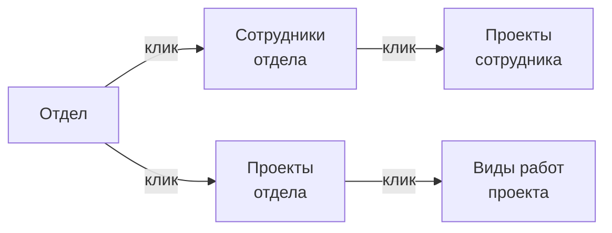

# 04. Отчёты и аналитика

Раздел описывает дашборд «Отчёты»: режимы просмотра, фильтры, детализацию, Capacity Board и экспорт данных.

---

## Как открыть раздел «Отчёты»

1. В левом меню выберите **«Отчёты»** (значок 📊).
2. Откроется дашборд с двумя режимами просмотра — «Сводка» и «Тренд».
3. По умолчанию открывается режим **«Сводка»** за текущий месяц.

> 📸 [Скриншот: дашборд «Отчёты» — переключатель режимов «Сводка» / «Тренд» вверху, таблица данных]

> **Заметка (ПДн):** Отображение ФИО управляется настройкой **«Показывать ФИО»** (`revealEmployeeNames`) в Параметрах. Если включена — отчёты показывают ФИО; если выключена — вместо ФИО стабильный **код сотрудника** (`Сотрудник·XXXX`, без ПДн). Управляет администратор (152-ФЗ).

---

## Режим «Сводка»

Сводка показывает агрегированные данные за выбранный период в разрезе одного из четырёх измерений.

### Карточки KPI (верхняя строка)

В верхней части дашборда — четыре карточки с ключевыми показателями:

| Карточка | Что показывает |
|----------|---------------|
| **Факт (ч)** | Суммарные часы всех записей за период |
| **Норма (ч)** | Плановые часы по производственному календарю |
| **Утилизация (%)** | Доля клиентских часов от ФАКТА (client / fact), не от нормы |
| **Недогруз (ч)** | Разница между нормой и фактом (если факт < нормы) |

> 📸 [Скриншот: четыре KPI-карточки — факт, норма, утилизация, недогруз]

### Выбор группировки (ось среза)

Данные можно сгруппировать по одному из четырёх измерений:

| Кнопка | Группировка | Строка таблицы |
|--------|-------------|----------------|
| **По отделу** | Dept | Одна строка = один отдел |
| **По проекту** | Project | Одна строка = один проект |
| **По сотруднику** | Employee | Одна строка = один сотрудник* |
| **По виду работ** | WorkType | Одна строка = один вид работ |

> *ФИО или код сотрудника — по настройке «Показывать ФИО» (см. выше).

> 📸 [Скриншот: переключатель группировки — четыре кнопки «Отдел / Проект / Сотрудник / Вид работ»]

### Структура таблицы сводки

```
┌─────────────────────┬────────────┬─────────────────┬──────────┬──────────┬────────────┐
│ Название            │ Факт/Норма │ Категории работ │ Утилизац.│ Недогруз │ Детализиров│
├─────────────────────┼────────────┼─────────────────┼──────────┼──────────┼────────────┤
│ ОИБ                 │ ██▓░  87ч  │ ████ 🟢🔵🟠     │   91%    │  0 ч     │   →        │
│ ОПИБ                │ ████  120ч │ ██████ 🟢🔵     │   78%    │  26 ч    │   →        │
│ ТЦ                  │ ██░░   45ч │ ████ 🟠🟣       │   42%    │  63 ч    │   →        │
└─────────────────────┴────────────┴─────────────────┴──────────┴──────────┴────────────┘
```

**Колонки таблицы (режим «По отделу» или «По сотруднику»):**

| Колонка | Описание |
|---------|---------|
| **Название** | Отдел / сотрудник / проект / вид работ |
| **Факт/Норма** | Прогресс-бар: заливка = факт, общая ширина = норма |
| **Категории** | Стек-бар состава работ (по категориям WorkCategory) |
| **Утилизация** | Доля клиентских (эффективных) часов от фактически отработанных (client / fact) |
| **Недогруз** | Абсолютные часы ниже нормы (0, если факт ≥ нормы) |

**Колонки в режиме «По проекту»:**

| Колонка | Описание |
|---------|---------|
| **Название** | Название проекта + чип категории (Клиент / Пресейл / …) |
| **Факт/Бюджет** | Мини-бар: факт vs плановый бюджет часов |
| **Факт (ч)** | Абсолютное значение |
| **Остаток** | Сколько часов осталось до бюджета (или перерасход) |

> **Заметка:** Для проектов без установленного бюджета в колонке отображается «нет плана».

### Сортировка

Кликните на заголовок любой колонки для сортировки:
- Первый клик — сортировка по возрастанию.
- Второй клик — сортировка по убыванию.
- Третий клик — сброс сортировки.

---

## Фильтры

Под KPI-карточками расположена строка фильтров.

### Фильтр по периоду

- Стрелки **‹** и **›** переключают период (месяц или квартал в зависимости от гранулярности).
- Кнопка с текущим периодом отображает его название: «Июнь 2025», «Q2 2025» и т. д.

> 📸 [Скриншот: навигация по периоду — стрелки и название периода]

### Фильтр по категории работ

Чип «Категория» позволяет ограничить данные по категории проекта:

| Категория | Описание |
|-----------|---------|
| На клиента (эффективные) | Коммерческие проекты, влияют на утилизацию |
| Пресейл | Предпродажные активности |
| Пилот | Пилотные проекты |
| Внутренний проект | Внутренние улучшения и разработки |
| Инфраструктура | IT-инфраструктура и поддержка |
| Самообучение | Обучение и развитие |

По умолчанию показываются все категории. Выберите одну или несколько для фильтрации.

---

## Drill-down — детализация строки

Drill-down позволяет «провалиться» в строку и увидеть более детальный срез.

### Как работает drill-down

1. Кликните на строку в таблице (у кликабельных строк появляется стрелка **→** или подсветка при наведении).
2. Дашборд перейдёт на уровень ниже — например:
   - **Отдел → Сотрудники отдела**
   - **Отдел → Проекты отдела**
   - **Проект → Виды работ по проекту**
3. В верхней части появится панель **Breadcrumbs (хлебные крошки)** — путь навигации.

> 📸 [Скриншот: drill-down — кликнута строка «ОИБ», показаны сотрудники отдела, breadcrumbs «Отчёты → ОИБ»]

### Breadcrumbs (хлебные крошки)

```
Отчёты  ›  ОИБ  ›  Иванов И.И.
```

- Кликните на любой элемент пути — вернётесь на соответствующий уровень.
- Кликните на **«Отчёты»** — вернётесь на верхний уровень.

### Уровни детализации



> **Заметка:** Не все строки кликабельны — если детализация недоступна, курсор не меняется на указатель. Это происходит, когда дочерних данных нет (например, проект без записей).

---

## Режим «Тренд»

Тренд показывает динамику утилизации по месяцам — для оценки загрузки команды во времени.

### Как переключиться на Тренд

1. Нажмите кнопку **«Тренд»** в переключателе режимов (рядом с «Сводка»).
2. Откроется страница с гистограммой.

> 📸 [Скриншот: режим «Тренд» — гистограмма с месяцами по оси X, часы по оси Y]

### Как читать график

```
Ч  160 ┤
а  140 ┤        █████
с  120 ┤  █████ █████ █████
ы  100 ┤  █████ █████ █████
    80 ┤  █████ █████ █████ ░░░░░
    60 ┤  █████ █████ █████ ░░░░░
    40 ┤  █████ █████ █████ ░░░░░
    20 ┤  █████ █████ █████ ░░░░░
       └──────────────────────────
         Янв   Фев   Мар   Апр
```

| Элемент | Что означает |
|---------|-------------|
| **Тёмные столбцы (факт)** | Фактически отработанные часы по месяцам |
| **Светлые столбцы (норма)** | Нормативные часы по производственному календарю |
| **Линия % (утилизация)** | Доля клиентских часов от факта (client / fact) — поверх столбцов |
| **Наведение на столбец** | Тултип с детализацией: факт / норма / утилизация / недогруз |

### Фильтр по отделу в Тренде

В режиме «Тренд» доступен фильтр **«Отдел»**:
- Выберите конкретный отдел — график перестроится под него.
- «Все отделы» — суммарные данные компании.

### Что значит линия утилизации

- **Линия выше 80%** — хорошая загрузка командой на клиентские проекты.
- **Линия ниже 60%** — значительная доля внутренней работы или недогруз.
- **Пики** — периоды аврала (смотрите теги `OVERTIME` в сводке).
- **Провалы** — отпуска, больничные, переходные периоды.

---

## Capacity Board (доска загрузки)

Capacity Board — отдельная страница для планирования и контроля загрузки команды.

### Как открыть

В левом меню выберите **«Capacity»** или перейдите через кнопку в дашборде отчётов.

> 📸 [Скриншот: Capacity Board — матрица отделы × периоды, цветовая индикация загрузки]

### Структура Capacity Board

| Показатель | Описание |
|------------|---------|
| **План (ч)** | Плановые часы из бюджета / производственного календаря |
| **Факт (ч)** | Фактически введённые и согласованные часы |
| **Загрузка (%)** | Факт / план × 100% |

### Цветовая индикация загрузки

| Цвет | Диапазон загрузки | Интерпретация |
|------|--------------------|---------------|
| 🟢 Зелёный | 80–100% | Нормальная загрузка |
| 🔵 Синий | > 100% | Перегрузка |
| 🟡 Жёлтый | 60–79% | Недозагрузка |
| 🔴 Красный | < 60% | Критический недогруз |

---

## Экспорт данных

### Доступные форматы

На дашборде «Отчёты» доступна кнопка **«Экспорт»** в правом верхнем углу:

| Формат | Когда использовать |
|--------|--------------------|
| **CSV** | Обработка в Excel / Google Sheets |
| **XLSX** | Excel с форматированием |

### Что экспортируется

- Экспортируется текущее состояние таблицы: выбранный период, группировка и фильтры.
- Drill-down уровень тоже экспортируется — если вы провалились в конкретный отдел, экспортируются данные этого отдела.
- KPI-карточки в экспорт не попадают — только строки таблицы.

> ⚠️ **Важно:** Экспорт следует настройке «Показывать ФИО»: при выключенной — в файле код сотрудника вместо ФИО (CISO-007, без утечки ПДн); при включённой — ФИО. Медицинские коды (больничный) в табеле — только для уполномоченных ролей.

---

## Часто задаваемые вопросы

### ❓ «Почему в таблице меньше данных, чем ожидалось?»

Проверьте:
1. Выбранный период — он мог остаться с предыдущего сеанса.
2. Активные фильтры категорий — возможно, выбрана только одна категория.
3. Статус таймшитов — в отчётах могут быть только **согласованные** записи (настройка зависит от конфигурации системы). Уточните у администратора.

### ❓ «Как посмотреть данные за квартал?»

На данный момент стандартная гранулярность — месяц. Для квартального среза:
1. Экспортируйте три месяца отдельно и объедините в Excel.
2. Или обратитесь к администратору — квартальная группировка может быть доступна в настройках.

### ❓ «Строка не кликается — drill-down не работает»

Drill-down доступен только тогда, когда у строки есть дочерние данные. Если данных нет (например, проект в этом периоде не имел записей) — строка некликабельна. Убедитесь, что выбран правильный период.

### ❓ «График тренда показывает нули за последний месяц»

Это нормально, если месяц ещё не закончился. Данные за незавершённые периоды могут быть неполными — часть сотрудников ещё не отправила таймшиты. Сравнивайте завершённые месяцы.

### ❓ «Утилизация 0% — но записи есть»

Утилизация считается **только по категории «На клиента»**. Если все записи за период относятся к категориям «Внутренний», «Инфраструктура» или «Обучение» — утилизация будет 0%. Проверьте, правильно ли указана категория у проектов.

### ❓ «Можно ли добавить свои группировки или срезы?»

Стандартные группировки фиксированы (отдел / проект / сотрудник / вид работ). Нестандартные срезы доступны через экспорт с последующей обработкой в Excel или через обращение к администратору для настройки дополнительных отчётов.
