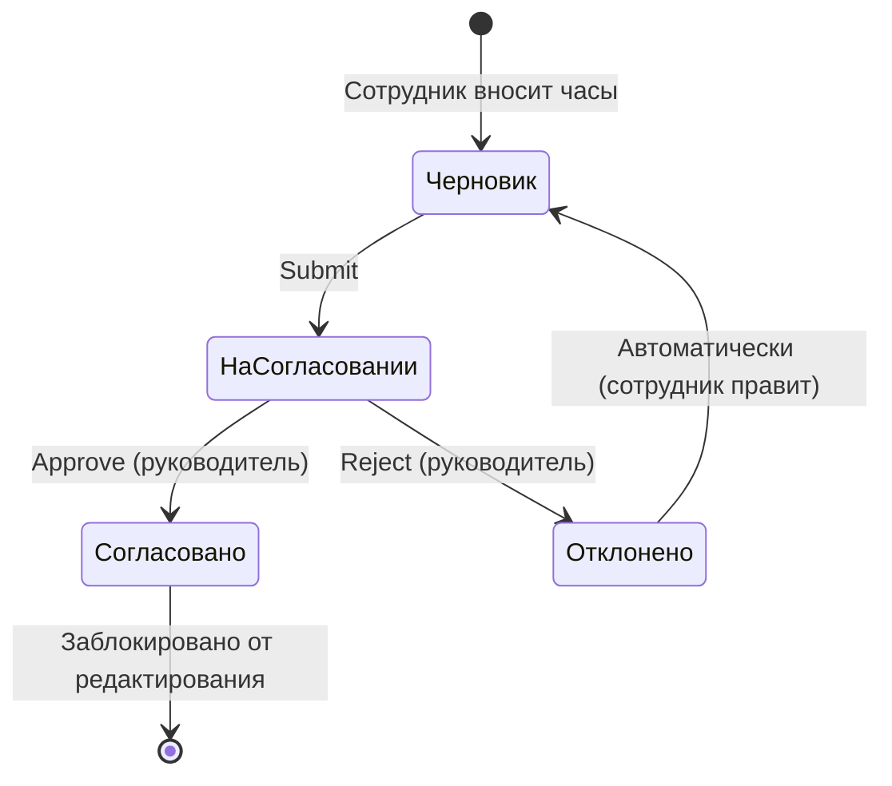

# Руководство пользователя — Учёт трудозатрат Кредос

> **Версия:** v1.0 (см. [docs/RELEASE_NOTES_v1.0.md](../RELEASE_NOTES_v1.0.md)). Мануал соответствует продакшн-релизу v1.0.0.

Модуль учёта трудозатрат работает на платформе Twenty CRM и позволяет сотрудникам вносить отработанные часы, руководителям — согласовывать таймшиты, а аналитикам и управленцам — анализировать загрузку команды в разрезе проектов, отделов и видов работ.

Данные вводятся понедельно в виде сетки «строка = проект + вид работ, колонки = дни». Согласование проходит по цепочке: черновик → на согласовании → согласовано / отклонено.

---

## Оглавление

| # | Раздел | Описание |
|---|--------|----------|
| [01](01-quickstart.md) | Быстрый старт | Первые шаги: войти, внести часы, отправить |
| [02](02-timesheet.md) | Заполнение таймшита | Подробное описание сетки, автосохранения, тегов, отправки |
| [03](03-approval.md) | Согласование | Для руководителей: batch-approve, отклонение, отзыв (recall/revoke), ввод за сотрудника, закрытие периодов |
| [04](04-reports.md) | Отчёты и аналитика | Сводка, тренд, drill-down, Capacity Board |
| [05](05-planning.md) | Планирование | Доска загрузки, план проекта/сотрудника, coverage, бронь |
| [06](06-settings.md) | Настройки модуля | Для администратора: нормы, ёмкость, lockdown, ПДн, отделы |

---

## Кто что читает

| Роль | Обязательные разделы | Дополнительно |
|------|----------------------|---------------|
| 👤 **Сотрудник** | [Быстрый старт](01-quickstart.md) · [Таймшит](02-timesheet.md) | [Отчёты](04-reports.md) — свои данные |
| 👔 **Руководитель** | [Быстрый старт](01-quickstart.md) · [Таймшит](02-timesheet.md) · [Согласование](03-approval.md) · [Планирование](05-planning.md) | [Отчёты](04-reports.md) — по отделу |
| ⚙️ **Администратор** | Все разделы | Дополнительно: техническая документация в `docs/developer/` |

---

## Основные объекты системы

| Объект | Что это |
|--------|---------|
| **Запись трудозатрат** (Time Entry) | Один факт работы: сотрудник + проект + вид работ + дата + часы |
| **Отдел** (Department) | Подразделение компании; задаёт норму согласования |
| **Проект** (Project) | Клиентский или внутренний проект, к которому привязываются часы |
| **Сотрудник** (Employee) | Карточка сотрудника с привязкой к отделу |
| **Вид работ** (WorkType) | Классификатор деятельности (разработка, анализ, встречи и т. д.) |

---

## Жизненный цикл таймшита

---

> **Заметка:** Если у вас нет доступа к разделам, описанным в руководстве, — обратитесь к администратору для назначения нужной роли.
